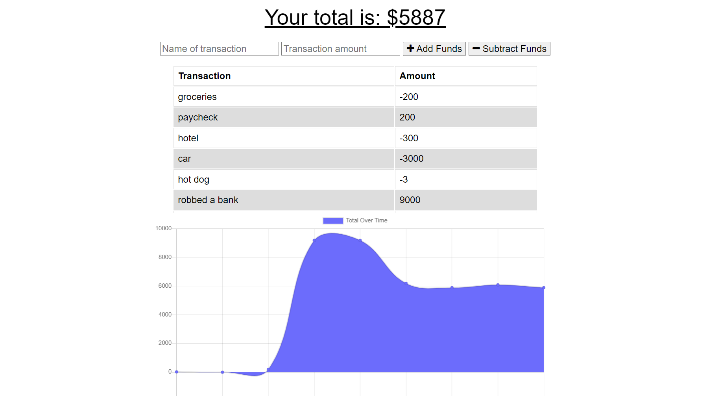

# Budget Tracker

# Table of Contents
[Description](#description)
 
[Access/Use](#access/use)
 
[License](#license)
 
[Questions](#questions)

# Description
  People who are always on the go may need a way to keep track of what they're spending. This app conveniently and easily displays remaining funds. It allows for easy input of transactions, whether deposits or withdrawals. It also has offline functionality, recording all transactions made without the internet and adding them in when the application reconnects.

  

# Access/Use
  This application is currently deployed at https://abracadabrant-monsieur-76482.herokuapp.com/. You can visit the Github repository for it here: https://github.com/TessShearer/Progressive-Web-Application.

# License
  This project remains unlicensed.

# Questions
Contact Information: If you have questions, view the GitHub profile below or direct them to the below email.  
-Email: [shearer.tess@gmail.com](mailto:shearer.tess@gmail.com)  
-GitHub: [TessShearer](https://github.com/TessShearer)
